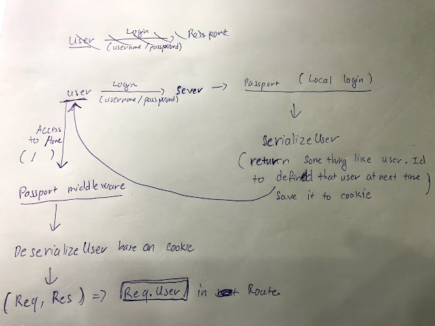
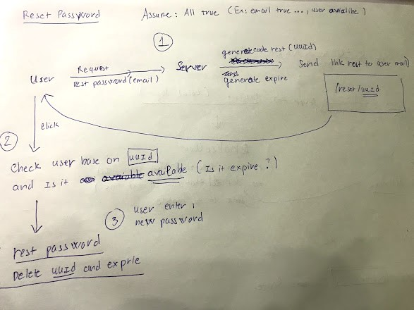

- What is passport?
http://www.passportjs.org/
- How to step up?
In `handlers/passport` file
```JavaScript
const passport = require('passport');
const mongoose = require('mongoose');
const LocalStrategy = require('passport-local');
const User = mongoose.model('User');

const {LOCAL_LOGIN} = require('../constant');

/**
 * Setting for passport with Strategy used
 */
passport.use(LOCAL_LOGIN, new LocalStrategy(
  {usernameField: 'email', session: false},
  async (email, password, done) => {
    try {
      const user = await User.findOne({email});
      if(!user) return done(null, false, { message: 'Sai tên người dùng hoặc mật khẩu.'});
      if(!user.validatePassword(password)) return done(null, false, {message: 'Sai mật khẩu.'});
      return done(null, user);
    } catch (err) {
      return done(err);
    }
  }
));

/**
 * Serilize User
 * Happen when user login
 * Decide which with go to session
 */
passport.serializeUser((user, done) => {
  done(null, user.id);
});

/**
 * Deserialize User
 * Happen when user authenticated
 * This keep user login
 */
passport.deserializeUser((id, done) => {
  User.findById(id, function(err, user) {
    done(err, user);
  });
});
```

In `app.js`
```JavaScript
const express = require('express');
const session = require('express-session');
const passport = require('passport');
require('./handlers/passport'); // passport config

// Passport JS is what we use to handle our logins
// Middleware passport, must have
app.use(passport.initialize());
app.use(passport.session());
```





- How passport working?

